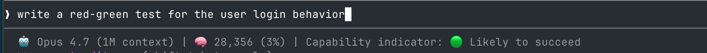
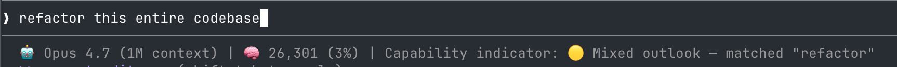
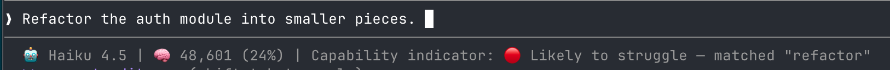

# Jagged Frontier Capability Indicator

A Claude Code plugin that shows a real-time signal of how likely the agent is to handle the user's next prompt well. The verdict renders in the status line, with a short rationale surfaced before the model responds.

Built as a research prototype to study whether a visible capability signal changes how developers write prompts, when they intervene, and how they calibrate trust in the agent.

## Motivation

AI coding agents perform along a jagged frontier of capability. The same model that nails a small bug fix can fail a refactor in the same codebase. Users learn this frontier through trial and error, costing time, tokens, and trust in the tool.

This prototype gives users a hint before they commit to a prompt, so they can re-scope, gather more context, or escalate to a stronger model.

## Research questions

- Does a real-time capability indicator change how developers write prompts, when they intervene, and how they trust the agent?
- Which features (heuristic, model-based, retrieval-grounded) best predict success on a given prompt?

## What it is

- A Claude Code plugin with two surfaces: a `UserPromptSubmit` hook and a custom status line.
- A demo-quality artifact for piloting the user experience of a capability indicator before investing in a real classifier.
- Three indicator states in the current code: green (likely to succeed), yellow (mixed outlook), red (likely to struggle).

## What it looks like

Three example states from the current demo build. Screenshots are example/demo data, not validated predictions.

**Green outlook.** Any prompt that does not contain the keyword "refactor", on any model. The classifier reports no known weak-spot patterns matched.

**Mixed outlook (yellow).** A prompt containing "refactor" while Opus 4.7 is the active model. The classifier escalates to a "Mixed outlook" verdict and surfaces a rationale about cross-file refactor risks before the model responds.

**Red outlook.** The same "refactor" prompt while Haiku 4.5 is the active model. The classifier escalates to "Likely to struggle" and recommends scoping the change or switching to a stronger model.

## What it is not

- Not a real classifier. The current logic is a single keyword check ("refactor") that branches on the active model. Outputs are example/demo data.
- Not validated against any dataset of successful or failed prompts.
- Not a finished UX. Status line position, colors, and copy are first-pass placeholders.
- Not yet privacy-reviewed for any deployment study.

## How it works

- Claude Code fires the `UserPromptSubmit` hook before sending the user's prompt to the model. The hook receives the prompt text and session id on stdin.
- `classifier.sh` runs a naive rule check, picks a verdict based on the active model, and writes the result to `/tmp/claude-classifier-${session_id}.json`.
- `statusline.sh` runs on each status line refresh, reads the state file, and renders the indicator alongside the active model and context window usage.
- The two scripts coordinate the active model through `/tmp/claude-model-${session_id}.txt`, written by the status line and read by the hook.
- The hook does not block or modify the prompt. The indicator is observational only.
- Latency is sub-10ms since the classifier is a regex match.

## The naive classifier (example/demo only)

Current rule:

- If the prompt contains "refactor" (case-insensitive), pick a verdict from a small table keyed on the active model family (Haiku, Opus, Sonnet, Unknown).
- Otherwise, mark the prompt as likely to succeed.

Rationale: "refactor" stands in for tasks that are context-heavy and span many files, which Sarkar et al. (2026) flagged as a frontier-edge variable. The keyword is illustrative only, not a research claim.

## Install

Prereqs:

- macOS or Linux with `bash` and `jq`.
- Node and `npx` for the context window segment (the status line calls `ccusage`).
- Claude Code installed and authenticated.

Steps (order matters):

1. Clone this repo.
2. Confirm the scripts are executable: `chmod +x classifier.sh statusline.sh`.
3. Open Claude Code in the repo directory: `cd jagged-frontier-demo && claude`. The included `.claude/settings.json` references `${CLAUDE_PROJECT_DIR}`, so Claude Code picks up the hook and status line automatically.

To use the plugin from a different working directory, copy `.claude/settings.json` into that project's `.claude/` folder and replace `${CLAUDE_PROJECT_DIR}` with the absolute path to this repo.

## Verify

- Start a session: `claude`.
- The status line shows the active model, context window usage, and `Capability indicator: ⚪ Awaiting first prompt`.
- Send a prompt containing "refactor". The status line turns yellow or red and a system message appears with the rationale.
- Switch model with `/model` and re-send the same prompt. The verdict changes.
- Send a prompt without "refactor". The status line turns green.

## Uninstall

Delete the clone. If you copied the settings into another project, revert that project's `.claude/settings.json`.

## Repo structure

- `classifier.sh`: the `UserPromptSubmit` hook. Reads the prompt, picks a verdict, writes the state file.
- `statusline.sh`: the status line renderer. Reads the state file, writes the active model file, prints the indicator line.
- `.claude/settings.json`: wires the hook and status line into Claude Code using `${CLAUDE_PROJECT_DIR}`.
- `.gitignore`: standard ignores plus `.claude/settings.local.json`.
- `README.md`: this file.

## Roadmap

- Replace the keyword check with a real classifier. Two-tier design: fast synchronous heuristics (prompt length, file scope, context window usage, harness type, risk keywords), plus an async Haiku call that updates the status line on the next refresh with richer reasoning.
- Log (prompt, predicted label, actual outcome) tuples for offline evaluation. Outcome signals: tool-call success, user follow-up corrections, self-report.
- Move from three discrete states to a continuous score once the classifier produces calibrated uncertainty.
- Add a "why" affordance so users can inspect which features drove the verdict.
- Run a small lab study (5 to 8 SCU HCI participants) before any field deployment.
- Plan a deployment study with developers using Claude Code in their normal work.

## Theoretical grounding

- Dell'Acqua, F., et al. (2023). Navigating the jagged technological frontier. Harvard Business School working paper.
- Sarkar, A., et al. (2026). CHI 2026 paper on context, harness, window position, and task risk in AI coding agents. Title and citation to confirm.
- Vaithilingam, P., et al. Programmer experiences with AI code assistants.
- Kapoor, S., et al. Open-world evaluations for measuring frontier AI capabilities.

## Limitations

- The "refactor" keyword is a placeholder. Do not interpret indicator output as a real prediction.
- Coverage is limited to Claude Code. Findings will not generalize directly to Cursor, Windsurf, or chat-based interfaces without re-implementation.
- Any future study population skews toward developers comfortable with CLI tools.
- The hook has read access to all prompt text. Any deployment study needs IRB review and a participant-facing privacy notice.
- State files live in `/tmp` and clear on reboot.

## Team

- Lab: SCU Human-Computer Interaction Lab (https://scuhci.com), directed by Kai Lukoff.
- Prototype: Kai Lukoff.
- Design and study planning: Tiffany Le and Akaash Trivedi.

## License

TBD, leaning toward MIT for a research artifact. Open an issue if you have a reason to restrict.

## Contact

- klukoff@scu.edu
- Issues welcome. This is an active research prototype, not a maintained product.
